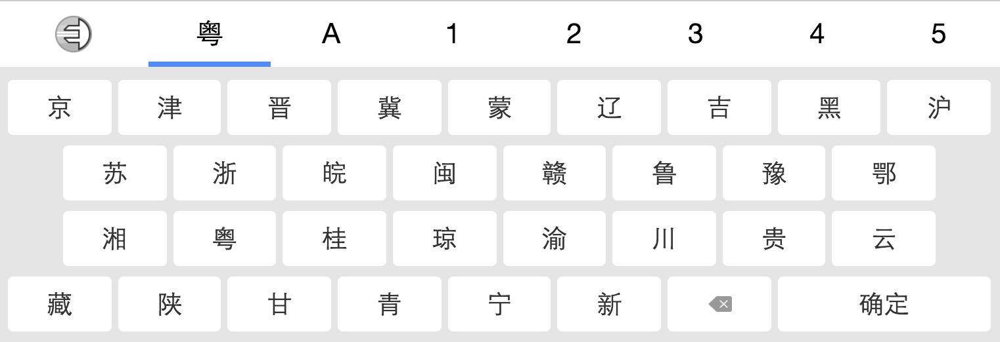

# 停车王车牌号码专用键盘 VehicleKeyboard - vue.js

GitHub项目主页： [https://github.com/parkingwang/vehicle-keyboard-js](https://github.com/parkingwang/vehicle-keyboard-js)

## 键盘输入框混合组件使用说明

[键盘输入框混合组件](./MixedKeyboardUsage.md)

混合组件包括键盘和输入框两部分组件，具有完成的车牌输入逻辑。

基于VUE.js实现的单组件，单JS文件，包含vue核心库，文件大小约 114KB。

## 单键盘组件使用说明

[单键盘组件的使用方法](./SingleKeyboardUsage.md)

单键盘组件只包含键盘组件部分。

基于VUE.js实现的单组件，单JS文件，包含vue核心库，文件大小约 105KB。

## 键盘逻辑引擎使用说明

[键盘逻辑引擎使用说明](./Engine.md)

## 车牌号码规则

1. 本公司整理的车牌号码规则：[停车王车牌号码专用键盘规则和设计说明](./NumberRules.md)

1. [中华人民共和国民用机动车号牌](https://zh.wikipedia.org/wiki/%E4%B8%AD%E5%8D%8E%E4%BA%BA%E6%B0%91%E5%85%B1%E5%92%8C%E5%9B%BD%E6%B0%91%E7%94%A8%E6%9C%BA%E5%8A%A8%E8%BD%A6%E5%8F%B7%E7%89%8C)

## 已知问题

- 在 Android4.4 以下的浏览器或者WebView中，由于不支持CSS3部分特性，会出现输入框界面宽度变化的问题；

## 版本更新记录

### v2017.1108

- 完成基础功能，更新文档并公开发布；

## License

    Copyright 2017 Xi'an iRain

    Licensed under the Apache License, Version 2.0 (the "License");
    you may not use this file except in compliance with the License.
    You may obtain a copy of the License at

    http://www.apache.org/licenses/LICENSE-2.0

    Unless required by applicable law or agreed to in writing, software
    distributed under the License is distributed on an "AS IS" BASIS,
    WITHOUT WARRANTIES OR CONDITIONS OF ANY KIND, either express or implied.
    See the License for the specific language governing permissions and
    limitations under the License.